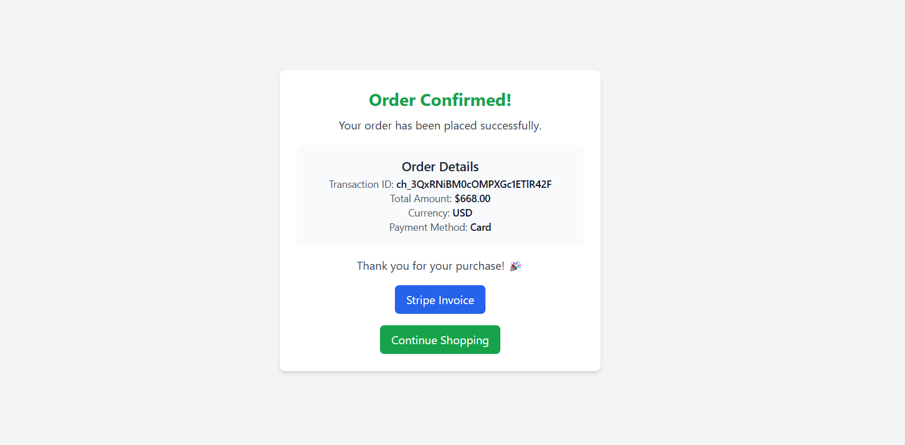

# PHP Task: Shopping Cart Checkout System

## Overview
Create a simple checkout system with PayPal payment gateway integration(Used Stripe instead) using vanilla PHP (no frameworks). The system should process a predefined cart of products through PayPal checkout.

### Technical Requirements
- PHP 8.1 or higher
- No PHP frameworks allowed (vanilla PHP only)
- Object-Oriented Programming (OOP) principles
- PSR-4 autoloading
- Composer for dependency management
- Clean, well-documented code following PSR coding standards

### Get 
- Clone the repository - `git clone git@github.com:zahirulnahid/ollyo-php-developer-task.git`
- Run `cd ollyo-php-developer-task`
- Run `composer install`

## Features
- **Stripe Integration**: Secure payment processing with Stripe.  
- **Product Checkout**: A predefined cart checkout system.  
- **Transaction Handling**: Payment verification, validation, and confirmation.  
- **OOP-Based Architecture**: Organized using controllers and handlers.  
- **Success & Failure Pages**: Users receive appropriate feedback after transactions.

## Screenshots
### Checkout Page

### Confirmation Page

### Payment Success

### Payment Failure

